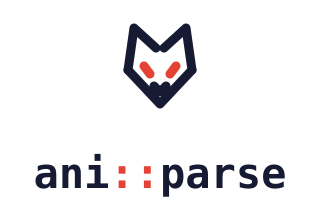

<div align="center">

<picture>
  <source media="(prefers-color-scheme: dark)" srcset="assets/lockup-dark.svg">
  
</picture>

**C++ library for parsing anime, manga, images and video**


[](https://github.com/AnAgTeam/aniparse/actions/workflows/coverage.yml)
[](https://codecov.io/gh/AnAgTeam/aniparse)

**English** · [Русский](README.ru.md)

</div>

> [!WARNING]
> The library is in an early stage of development; the API may change substantially.

---

## About

**aniparse** is a static C++20 library for parsing content from various sources. The primary focus is anime and manga; fetching images and video is also supported.

It is built on an asynchronous network layer ([libasyncnet](https://github.com/AnAgTeam/libasyncnet)) and the [lexbor](https://github.com/lexbor/lexbor) HTML parser, so it processes web pages efficiently without heavy dependencies.

---

## Design principles

**All-in-one, by design.** Search, routing, catalog, cookies and selectors are content-neutral — a new content type is a getter, not a fork. Manga leads today; anime and booru are what the design invites, not a rewrite away.

**A new parser is quick to write.** A source is a copy of the [skeleton](examples/example_manga_parser.cpp), a handful of CSS selectors and a fixture test — networking, routing, errors and cookies are the library's job.

**Fragile things are data.** Sites break, and the library is designed around that: domains, mirrors and selectors belong in refreshable data, not code — so fixing a source shouldn't mean shipping a new binary.

**Native, down to iOS.** A static C++20 library with no runtime behind it — no Node, no Python, no Android bindings. The HTTP backend is swappable (NSURLSession-ready), and the public API is designed with Swift interop in mind.

---

## Features

- Parsing anime titles (releases, metadata)
- Parsing manga
- Fetching images and video from various sources
- Backend-neutral HTTP client: curl today, but the request/response contract is not tied to it (the backend can be swapped, e.g. for NSURLSession)
- Typed `request_html` / `request_json` requests with exception-free error handling (`tl::expected`)
- Built-in HTML/DOM parser, CSS selectors and a JS parser powered by `lexbor`
- Parser cookies and authentication, `multipart/form-data`, arbitrary HTTP methods
- No code from the network: only data ever crosses the wire, never executable code — parsers are compiled in, so there's no downloadable-extension attack surface

---

## Roadmap

- [x] Backend-neutral HTTP contract (curl today, swappable backend)
- [x] Typed `request_html` / `request_json` with exception-free errors
- [x] CSS selectors and JS variable extraction
- [ ] First full-featured manga source
- [ ] URL routing: hand the library a link, get the right parser and content
- [ ] Data-driven source catalog: domain mirrors and volatile selectors refresh at runtime — broken sources get fixed without an app release
- [ ] Configurable request retries
- [ ] HTTP caching (ETag)
- [ ] Streaming downloads for large media
- [ ] Swift bindings and an NSURLSession backend for iOS/macOS
- [ ] Parser-writing tutorial: a new source in an evening
- [ ] vcpkg port

Want one of these sooner — or a source we don't cover yet? Issues and PRs are welcome.

---

## Quick start

Fetch a page and parse it as HTML — the client is backend-neutral, a parser never sees curl:

```cpp
#include <aniparse/Client.hpp>
#include <aniparse/ClientContext.hpp>
#include <coro/sync_wait.hpp>
#include <print>

using namespace aniparse;

int main() {
    auto client = std::make_shared<AsyncClient>();
    RequestorContext ctx(client, nullptr, nullptr);

    // request_html: fetch + status check + parse, all in one expected value.
    auto page = coro::sync_wait(ctx.request_html(GetRequest{ .url = "https://example.com" }));
    if (page) {
        std::println("{}", page->title());
    }
}
```

To write your own source, copy the [parser skeleton](examples/example_manga_parser.cpp) and fill in the getters. See all [examples](#examples) below.

---

## How it works

A **`Parser`** registers the domains it handles and exposes getters (e.g. `MangaRootGetter`) that fetch and parse content. Getters run through a **`RequestorContext`**, which carries the parser's config, cookies and logger and sits on top of a backend-neutral **`ClientContext`** (curl today). Parsers only ever touch neutral request/response types — so the HTTP backend can be replaced without changing a single parser.

---

## Requirements

- **Compiler:** with C++20 support (GCC 12+, Clang 15+, MSVC 2022+). The examples and tests are built as C++23 (they use `std::print` / `std::println`), so they need a newer compiler and standard library (roughly GCC 14+, Clang 18+, MSVC 19.40+).
- **CMake:** 3.18+
- **vcpkg** (recommended for dependency management)

**Dependencies** (installed via vcpkg). All are required — the library links them unconditionally:

| Package | Purpose |
|---|---|
| `boost-json` | JSON parsing |
| `boost-regex` | Regular expressions |
| `boost-system` | Boost system utilities |
| `curl` | HTTP client (via `libasyncnet`) |
| `fmt` | String formatting |
| `tl-expected` | Exception-free error handling (`tl::expected`) |

Submodules (pulled in automatically):
- [lexbor](https://github.com/lexbor/lexbor) — HTML parser
- [libasyncnet](https://github.com/AnAgTeam/libasyncnet) — asynchronous networking

---

## Building

### Cloning

```bash
git clone --recurse-submodules https://github.com/AnAgTeam/aniparse
cd aniparse
```

### With vcpkg (recommended)

```bash
cmake -B build \
  -DCMAKE_TOOLCHAIN_FILE=/path/to/vcpkg/scripts/buildsystems/vcpkg.cmake \
  -DCMAKE_BUILD_TYPE=Release
cmake --build build
```

### Without vcpkg

Make sure the dependencies are installed on the system, then:

```bash
cmake -B build -DCMAKE_BUILD_TYPE=Release
cmake --build build
```

### CMake options

| Option | Default | Description |
|---|---|---|
| `ANIPARSE_BUILD_TESTS` | `OFF` | Build tests |
| `ANIPARSE_BUILD_EXAMPLES` | `OFF` | Build examples |
| `ANIPARSE_BUILD_TOOLS` | `OFF` | Build tools |

---

## Installation

```bash
cmake --install build --prefix /usr/local
```

After installation the library is available through CMake:

```cmake
find_package(aniparse REQUIRED)
target_link_libraries(your_target PRIVATE aniparse::aniparse)
```

Or through pkg-config:

```bash
pkg-config --libs --cflags aniparse
```

---

## Examples

The examples live in the [`examples/`](examples/) directory. To build them:

```bash
cmake -B build -DANIPARSE_BUILD_EXAMPLES=ON
cmake --build build
```

- [Parser skeleton](examples/example_manga_parser.cpp) — the shape of a parser: which methods to implement. Copy it for your own source.
- [Parsing](examples/example_parse.cpp) — extracting data from HTML: CSS selectors, DOM, JSON from a `<script>`. Runs offline, against a fixture.
- [Networking](examples/example_net.cpp) — real HTTP requests via `request` / `request_html` / `request_json`.

---

## Project structure

```
aniparse/
├── include/aniparse/       # Public headers
│   ├── anime/              # Anime parsing (Release, etc.)
│   ├── manga/              # Manga parsing
│   ├── images/             # Image parsing
│   ├── html/               # HTML/DOM/JS parser
│   └── utility/            # Helper utilities
├── src/                    # Implementation
├── examples/               # Usage examples
├── tests/                  # Tests
├── tools/                  # Additional tooling
├── lexbor/                 # Submodule: HTML parser
└── libasyncnet/            # Submodule: asynchronous networking
```

---

## Contributing

Pull requests and issues are welcome. Make sure the code builds without warnings (`-Wall -Wextra -Wpedantic`) and passes the tests:

```bash
cmake -B build -DANIPARSE_BUILD_TESTS=ON
cmake --build build
ctest --test-dir build
```

---

## License

Distributed under the [MIT](LICENSE) license. Copyright © 2025–2026 Toilettrauma.

Note: the project bundles third-party components under their own licenses — see the [NOTICE](NOTICE) file.
